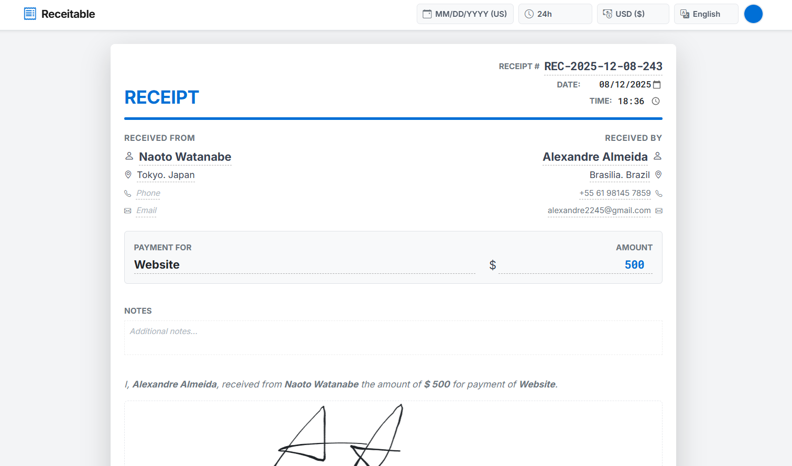

<div align="center">
  <h1>📄 Receiptable</h1>
  <p>
    <strong>フリーランサーや中小企業のための、プライバシー重視・超シンプルな領収書作成ツール。</strong>
  </p>

  <p>
    <a href="./README.md">🇺🇸 English</a> |
    <a href="./README.pt.md">🇧🇷 Português</a>
  </p>

  <p>
    
    
    
  </p>
</div>

<br />

**Receiptable** は、ブラウザベースの軽量ツールで、美しくプロフェッショナルな領収書を数秒で作成できるように設計されています。登録不要、バックエンドサーバーなし、データ追跡なし。すべての処理はお使いのブラウザ内でローカルに行われます。

> 💡 **ヒント:** **請求書**を作成したい場合は、兄弟プロジェクトの [Invoicable](https://github.com/TetsuakiBaba/invoicable) をご覧ください。



## ✨ 主な特徴

* **⚡ 直感的な編集:** テキストフィールドをクリックして直接編集できます。見たままの状態で作成可能です (WYSIWYG)。
* **🌍 多言語対応:** **日本語**、**英語**、**ポルトガル語**を完全サポート。
* **💱 多通貨対応:** 主要20通貨（JPY, USD, EUR, BRLなど）に対応し、通貨記号も自動で切り替わります。
* **🎨 カスタムテーマ:** ブランドカラーに合わせて、カラーピッカーで色を自由にカスタマイズ可能。
* **📅 日付フォーマット:** 日本形式 (YYYY-MM-DD)、米国形式、ブラジル形式に対応。
* **🔒 プライバシー重視:** **Local Storage** を使用して進捗を自動保存します。財務データが外部サーバーに送信されることはありません。
* **📄 PDF出力:** A4サイズに最適化された清潔なPDFを生成し、印刷やメール送信にすぐに使えます。
* **🔗 共有リンク:** 領収書データを含むURLを生成し、テンプレートとして保存したり共有したりできます。

## 🚀 はじめに

Receiptableはウェブ上で直接使用するか、ローカル環境で実行できます。

### ローカルでの実行

1.  リポジトリをクローンします:
    ```bash
    git clone [https://github.com/TetsuakiBaba/receiptable.git](https://github.com/TetsuakiBaba/receiptable.git)
    ```
2.  フォルダに移動します:
    ```bash
    cd receiptable
    ```
3.  `index.html` を最新のウェブブラウザで開きます。

## 🛠️ 使い方

1.  **設定:** 上部のツールバーで、言語、通貨、日付形式、テーマカラーを選択します。
2.  **編集:** 「宛名」や「但し書き」などのフィールドをクリックして情報を入力します。
3.  **詳細情報:** 下部のセクションに支払い詳細や備考を入力します。
4.  **出力:** **PDF保存** をクリックしてファイルを保存するか、**リンク作成** で現在の状態をURLとして保存します。

## 🤝 貢献について

貢献は大歓迎です！改善点や新機能の提案がある場合は、以下の手順で行ってください。

1.  プロジェクトをフォーク (Fork) します。
2.  機能ブランチを作成します (`git checkout -b feature/AmazingFeature`)。
3.  変更をコミットします (`git commit -m 'Add some AmazingFeature'`)。
4.  ブランチにプッシュします (`git push origin feature/AmazingFeature`)。
5.  プルリクエスト (Pull Request) を作成します。

## 📜 ライセンス

MITライセンスの下で配布されています。詳細は `LICENSE` ファイルをご覧ください。

---
<div align="center">
  <p>2025 &copy; Receiptable.</p>
  <small>Original Project by <a href="https://github.com/TetsuakiBaba">Tetsuaki Baba</a>.</small><br>
  <small>Refactored by <a href="https://github.com/rubensbraz">Rubens Braz</a>.</small>
</div>